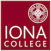
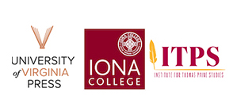

Thanks to the generous support of the Robert David Lion Gardiner Foundation, the Institute for Thomas Paine Studies (ITPS) and the University of Virginia (UVA) Press are collaborating to launch a two-year post-doctoral residential fellowship, in any area of American studies from 1700 to 1900, at Iona College in New Rochelle, New York. 

<<<<<<< HEAD
<<<<<<< HEAD

=======

>>>>>>> 44436d7a54ee80b54caca759a086b47bedcf6692

=======
>>>>>>> 334ac6ee9ed83c3eb6342fd1ace1e171319b0756
**Description**

Beginning in August of 2020 and concluding in May of 2022, this fellowship is focused on two components. The first is research, writing, and publication, and the second is archival development, preservation, and access. The appointed fellow will divide their time between research and writing on his/her/their individual project and the ongoing inventory, processing, and digitization of the Thomas Paine National Historical Association (TPNHA) collection held at Iona’s Ryan Library.

Reflecting the chronological scope of the TPNHA archive, which ranges from the late colonial and revolutionary eras through the late nineteenth and early twentieth centuries, this fellowship welcomes multi-disciplinary research in the Americas from 1700 to 1900. The collection reflects a wide range of artifacts from Paine’s lifetime and how his legacy was interpreted and applied through the Progressive Era. Also reflecting the diversity of the TPNHA collection, the ITPS and UVA Press welcome projects across the humanities, including history, art history, American studies, English, political science, media studies, and others.

The research, writing, and publication component of the fellowship includes:

* Revising a book manuscript – dissertation or other full-length scholarly study – for publication. 
* As part of this program, the fellow will receive a manuscript workshop with Nadine Zimmerli, Editor for History and Social Sciences at the University of Virginia Press, ITPS Director Nora Slonimsky, and three invited commentators. This workshop will be held early in the fellowship, within the first four months of the appointment.
* UVA Press will have the right of first acceptance of the resulting manuscript, and the Press holds first claim on publishing the appointed fellow’s completed work.

The archival component of the fellowship includes:

* Participation in archival processing, including inventorying and preparing descriptive collection guides for the Thomas Paine National Historical Association Collection (TPNHA) in collaboration with the ITPS and Iona College Libraries.
* Surveying the TPNHA Collection at Iona College and assisting in identifying items for a future digitization project in collaboration with the ITPS and Iona College Libraries.
* Assisting with planning and designing physical and digital exhibits highlighting the TPNHA Collection in collaboration with the ITPS Public Historian. This may also include collaborations with ITPS undergraduate interns.
* Participating in other scholarly activities of the ITPS, as they arise.

**Eligible Applicants and Compensation**

Applicants may not have previously published or have under contract the scholarly monograph which they are proposing to complete as part of the fellowship, and they must have met all requirements for the doctorate by August 1st, 2020. In addition to the stipend of $50,000 per year, the fellowship provides office space and computer facilities as well as some travel funds for conferences and related research. The award is open to all eligible persons equally, and welcomes applicants from diverse disciplinary, racial, ethnic, gender, sexuality, religious, economic, and other backgrounds. Iona College conducts background checks on applicants for employment.

**Application Materials**

Applicants can submit their materials via the Iona College employment website [here](https://iona-openhire.silkroad.com/epostings/index.cfm?fuseaction=app.jobInfo&version=1&jobid=678). Applications should include: a curriculum vitae of no more than five pages; a proposal not to exceed 1,500 words, double-spaced, describing the general scope of the project and the specific work proposed during the fellowship term; and an unpublished writing sample related to the project, double-spaced, limited to 7,500 word, not including notes. Two confidential letters of support should be submitted by email attachment to [itps@iona.edu](mailto:itps@iona.edu).

**Application Deadline and Notification**

Applications are due by *June 1st, 2020* via [Iona College](https://iona-openhire.silkroad.com/epostings/index.cfm?fuseaction=app.jobInfo&version=1&jobid=678).

A final decision will be made by *July 1st, 2020*. 

Please address any questions to Dr. Nora Slonimsky at [nslonimsky@iona.edu](mailto:nslonimsky@iona.edu) and Dr. Nadine Zimmerli at [nz5fm@virginia.edu](mailto:nz5fm@virginia.edu).